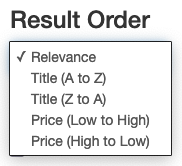
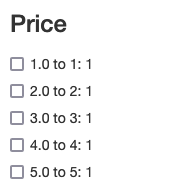

Using the Solr Bundle
=====================

Solr is a complex system and integrating it into a Symfony application is not
simple. There are many steps.

1. [Configure](config.md) the bundle
2. Add annotations and metadata to the entities to be indexed
3. Index the entities
4. Create search forms
5. Add solr search routes and controllers
6. Add templates for searching

Entities
--------

Solr Bundle's annotations are modelled after the annotations in the Doctrine 
ORM, and will hopefully seem familiar. 

Add the `@Solr\Document` annotation to each entity to be indexed and put
an `@Solr\Id` annotation on the unique entity identifier. Add the `@Solr\Field` 
annotation to each non-ID field to be indexed.

See the [annotations](annotations.md) documentation for details about each of the
annotations and the attributes they understand.

Commands
--------

This bundle provides commands to debug the annotations, ping the server, and 
interact with the core.

### Debug

`nines:solr:schema` will output information about which entities will be indexed
and how. In the example below `App\Entity\Ttle` is an entity that will be 
indexed. The entity identifier is accessed by the `getId` method. The solr 
field `title_txt` is constructed from the solr fields `main_t`, and `sub_t`.

The display also shows the other fields and infomration about how they are
constructed, mutated, or filtered. See [annotations](annotations.md) for details.

```console
$ ./bin/console nines:solr:schema
App\Entity\Title
  id => App\Entity\Title:getId
  type_s => Title
  title_txt <= [main_t,sub_t]
  content_txt <= [main_t,sub_t,description_t]
+-------------------+-------------+-----------------+---------+--------------------+
| name              | field       | getter          | mutator | filters            |
+-------------------+-------------+-----------------+---------+--------------------+
| main_t            | main        | getMain         |         |                    |
| sub_t             | sub         | getSub          |         |                    |
| price_f           | price       | getPrice        |         |                    |
| description_t^0.5 | description | getDescription  |         | strip_tags         |
|                   |             |                 |         | html_entity_decode |
| created_dt        | created     | getCreated      | format  |                    |
| updated_dt        | updated     | getUpdated      | format  |                    |
| tax_price_f       | tax_price   | getPriceWithTax |         |                    |
+-------------------+-------------+-----------------+---------+--------------------+
```

In this example, the entity ID is generated by calling `getId()`. The `title_txt` 
field is computed by combining the `main_t` and `sub_t` fields. `content_txt` is
also a computed field.

The first column in the table is the Solr field name. The second column is the 
entity's field name. The data will be fetched via the getter function. The 
description will be filtered via `strip_tags()` and `html_entity_decode()` in
that order. Created and updated return objects and `format()` will be called on
them to produce a tetual representation.

### Dump

`nines:solr:dump <class> <id>` will show how one instance of an entity would be
indexed in the Solr core.

In this example Title #1 would be indexed with these fields and values.

```console
$ ./bin/console nines:solr:dump Title 1
+---------------+----------------------+
| Field         | Value                |
+---------------+----------------------+
| id            | App\Entity\Title:1   |
| class_s       | App\Entity\Title     |
| type_s        | Title                |
| main_t        | Main 1               |
| sub_t         | Sub 1                |
| price_f       | 1                    |
| description_t | This is paragraph 1  |
| created_dt    | 2022-02-15T20:24:27Z |
| updated_dt    | 2022-02-15T20:24:27Z |
| tax_price_f   | 1.05                 |
| title_txt     | Main 1               |
|               | Sub 1                |
| content_txt   | Main 1               |
|               | Sub 1                |
|               | This is paragraph 1  |
+---------------+----------------------+
```

### Ping

Check that the bundle is configured and the server is running and reachable 
with `nines:solr:ping`.

```console
$ ./bin/console nines:solr:ping
Solarium library version: 6.2.3
200 OK
Ping: 37ms
```

### Server Commands

Remove all content from the Solr core with `nines:solr:clear`. This command does
not produce output unless there is an error.

```console
$ ./bin/console nines:solr:clear
```

Index (or reindex) content with `nines:solr:index`. 

```console
$ ./bin/console nines:solr:index
App\Entity\Title
 5/5 [============================] 100%
```

This command accepts the option `--clear` which will remove all content from 
the index first. Without this option, Solr will replace all content with new
content. Indexed data that does not correspond to something in the database will 
not be changed (eg. an entity was removed form the database but not the index 
will remain).

> `--clear` will remove all content from the Solr core, not the data
associated with the class name passed as an argument.

You can also choose which entities to index by passing the entity class name on
the command line. The command assumes a namespace prefix of `\App\Entity` unless 
you provide a fully-qualified class name. Note the of the backslashes
due to shell escaping rules.

```console
$ ./bin/console nines:solr:index --clear Title
App\Entity\Title
5/5 [============================] 100%

$ ./bin/console nines:solr:index --clear App\\Enitty\\Title
App\Entity\Title
5/5 [============================] 100%
```

Forms
-----

Form types are not provided for this bundle. Instead, some suggested twig 
partial templates are provided, which can be used directly, 
[overridden][override], or ignored as needed. The forms assume a 
[Bootstrap 3][bootstrap] base template and CSS.

`search_field.html.twig` renders a single text input with search and reset 
buttons. It expects the path to the search in the `path` template variable.

```twig
<div class='row'>
    
    
</div>
```


`order.html.twig` provides a dropdown to select the order of search results. It 
expects two parameters. `header` is the name of the section in the sidebar. 
`options` is a key, value array. The keys are strings of the form
`field`.`direction` and the values are the entries in the dropdown menu.

```twig
<div class='row'>
    <div class='col-sm-3'>
        
            
        
    </div>
</div>
```



`facet.html.twig` and `facet_range.html.twig` provide facets/filtering for 
search results. Facets are defined in the [index classes](index_classes.md). 

```twig
    
```



Indexes
-------

A SolrBundle Index class is like a Doctrine Repository class. They provide ways
to query the Solr index, along with ordering and filtering the results.

A simple search in a Solr index might look like this. The `$filters`, 
`$rangeFilters`, and `$order` will be explained below.

```php
    public function searchQuery(string $q, $filters = [], $rangeFilters = [], $order = null) {
        $qb = $this->createQueryBuilder();
        $qb->setQueryString($q);
        $qb->setDefaultField('content');
        return $qb->getQuery();
    }
```

In the example above, the `content` field is a copy field - it duplicates all
of field data in a single place for convenience. Without it, the code would 
need to construct a complex query string listing all of the fields to be 
searched, perhaps something like 

```php
 "title:{$q} OR subtitle:{$q} OR author:{$q}"`
 ```

and this query string would easily become out of date if fields are added or
removed.

### Limit Results by Type

By default, Solr queries will return any type of indexed docuemnt. The bundle
can limit results to one or more types with the `addFilter` method.

```php
        $qb->addFilter('type', ['Person', 'Alias']);
```

### Add Simple Filters

The `$filters` parameter in the `searchQuery` example above is expected to be an
array with string keys and string-array values. Add the filters to the query 
with the `addFilter` method in the query builder.

```php
        foreach ($filters as $key => $values) {
            $qb->addFilter($key, $values);
        }
```

> Text fields do not filter properly due to the way they are processed. String
and numeric fields filter well.

### Add Date Range Filters

Date range filters are also supported on `date` and `datetime` types. In this 
example, the facet spans a 50 year period, starting from 1750 and ending in 
the current year.

```php
        // Add the filters to the query input
        foreach ($rangeFilters as $key => $values) {
            foreach ($values as $v) {
                list($start, $end) = explode(' ', $v);
                $qb->addFilterRange($key, $start, $end);
            }
        }

        // Include the birthDate facet in the query output
        $year = date('Y');
        $qb->addFacetRange('birthDate', 1750, $year, 50);
```

### Highlighting Fields

Solr can return highlighted search results.

```php
        $qb->setHighlightFields(['fullName', 'description',
            'birthPlace', 'deathPlace', 'residences', 'aliases', ]);
```

### Set Result Order

If specified, the `$order` parameter should be the name of a Solr field with 
`.desc` or `.asc` appended. This parameter is used to set the sort order in the
index function.

```php
        if ($order) {
            $qb->setSorting($order);
        }
```

Finally, a complete example with all features enabled:

```php
namespace App\Index;

use Nines\SolrBundle\Index\AbstractIndex;
use Solarium\QueryType\Select\Query\Query;

class PersonIndex extends AbstractIndex {
    public function searchQuery(string $q, array $filters = [], array $rangeFilters = [], ?string $order = null) : Query {
        $qb = $this->createQueryBuilder();
        $qb->setQueryString($q);
        $qb->setDefaultField('content');

        $qb->addFilter('type', ['Person']);
        foreach ($filters as $key => $values) {
            $qb->addFilter($key, $values);
        }
        foreach ($rangeFilters as $key => $values) {
            foreach ($values as $v) {
                list($start, $end) = explode(' ', $v);
                $qb->addFilterRange($key, $start, $end);
            }
        }

        $year = date('Y');
        $qb->addFacetRange('birthDate', 1750, $year, 50);
        $qb->addFacetRange('deathDate', 1750, $year, 50);

        $qb->setHighlightFields(['fullName', 'description',
            'birthPlace', 'deathPlace', 'residences', 'aliases', ]);

        if ($order) {
            $qb->setSorting($order);
        }

        return $qb->getQuery();
    }

```

Controller Actions
------------------

A Symfony controller action to perform a search and return results must get the
query string, filters, range filters, and order from the HTTP request object. 
Then it creates the search query from an index class, and passes that query
to a `SolrManager` class to do the search and apply pagination.

In the example below, the action searches for Person records using the search
query function defined above.

```php
    /**
     * @Route("/solr", name="person_solr")
     * @Template
     */
    public function solrAction(Request $request, PersonIndex $repo, SolrManager $solr) {
        $q = $request->query->get('q');
        $result = null;
        if ($q) {
            $filters = $request->query->get('filter', []);
            $rangeFilters = $request->query->get('filter_range', []);

            $order = null;
            $m = [];
            if (preg_match('/^(\\w+).(asc|desc)$/', $request->query->get('order', 'score.desc'), $m)) {
                $order = [$m[1] => $m[2]];
            }

            $query = $repo->searchQuery($q, $filters, $rangeFilters, $order);
            $result = $solr->execute($query, $this->paginator, [
                'page' => (int) $request->query->get('page', 1),
                'pageSize' => (int) $this->getParameter('page_size'),
            ]);
        }

        return [
            'q' => $q,
            'result' => $result,
        ];
    }
```

Templates
---------

Templates are provided in `templates/` and can be 
[easily overridden][override].

[override]: https://symfony.com/doc/current/bundles/override.html#templates
[bootstrap]: https://getbootstrap.com/docs/3.4/
